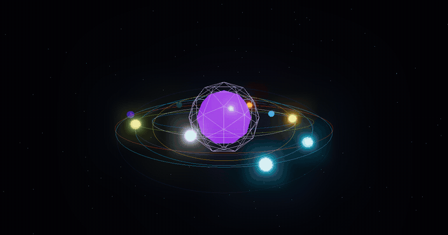

<!-- Orbit 3D hero — looping render, tech stack orbiting the core in 3D -->

  

  

<h1 align="center">Thang Nguyen</h1>

<i>Full-stack developer</i>

 

- 🌱 Currently working on **Full-Stack Development**
- 👯 Looking to collaborate on **open-source projects**
- 💬 Ask me about anything — always happy to help
- ⚡ Fun fact: I love building things that make a difference

## Stack

  

## Live stats

  
  

  

  

## Contribution snake

  

## Trophies

  

⭐️ From <a href="https://github.com/nguyenthangdev">Thang Nguyen</a>

